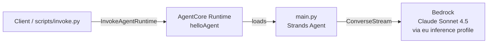

# agent-core-cdk

Deploy a minimal [Strands](https://strandsagents.com) agent on [AWS Bedrock AgentCore Runtime](https://docs.aws.amazon.com/bedrock-agentcore/) using AWS CDK in TypeScript. Backed by Anthropic Claude Sonnet 4.5 via the `eu` inference profile in `eu-central-1`.

## What this is

A minimal but production-shaped reference: one CDK stack, one AgentCore Runtime, one Strands agent, with the IAM policies you actually need (including the easily-missed AWS Marketplace subscription check). Use it as a starting point or read it to understand what an end-to-end AgentCore deployment looks like.

For the long-form walkthrough — the four IAM and billing layers between `cdk deploy` and the first successful invoke — see the companion post: [Deploying AWS Bedrock AgentCore with CDK: a quickstart](https://sph.sh/en/posts/agentcore-cdk-quickstart/).

## Architecture



The agent code is packaged as a direct code asset (no container, no ECR). `scripts/build-agent.sh` produces an `aarch64-manylinux2014` Python 3.13 wheel tree that AgentCore loads into its managed runtime.

## Prerequisites

- An AWS account with [CDK bootstrap](https://docs.aws.amazon.com/cdk/v2/guide/bootstrapping.html) completed in `eu-central-1`
- [Bedrock model access](https://docs.aws.amazon.com/bedrock/latest/userguide/model-access.html) enabled for `anthropic.claude-sonnet-4-5-20250929-v1:0` in the same region
- Node 22+ ([nvm](https://github.com/nvm-sh/nvm) recommended; `.nvmrc` provided)
- Python 3.13
- [uv](https://github.com/astral-sh/uv) for building the agent artifact
- AWS credentials configured (e.g. via `aws configure` or `AWS_PROFILE`)

## Deploy

```bash
npm ci
npm run build-agent              # builds agent/dist/ for aarch64 / py3.13
npx cdk bootstrap aws://<account>/eu-central-1   # first time only
npx cdk deploy
```

CDK prints `AgentRuntimeArn` on success. Hold onto it for invocation.

## Invoke

```bash
python scripts/invoke.py <AgentRuntimeArn> "Hello"
```

Set `AWS_REGION` if your local default differs from `eu-central-1`.

## Configuration

All knobs live in `cdk.json` under `context`:

| Key | Default | Purpose |
|---|---|---|
| `agentCore:region` | `eu-central-1` | Stack deploy region |
| `agentCore:modelId` | `anthropic.claude-sonnet-4-5-20250929-v1:0` | Foundation model id |
| `agentCore:runtimeName` | `helloAgent` | AgentCore runtime name (must be unique per account+region) |
| `agentCore:inferenceProfilePrefix` | `eu` | Cross-region inference profile prefix |
| `agentCore:description` | (see file) | Human-readable runtime description |

The agent's runtime reads `MODEL_ID` and `AWS_REGION` from the environment, defaulting to the same values, so you can override them without redeploying.

## Architecture decisions

**Why AgentCore Runtime instead of Lambda.** AgentCore is purpose-built for stateful agent sessions — long-running conversations, native Strands SDK integration, automatic session management. Lambda's 15-minute ceiling and stateless model are wrong for the shape of agent workloads.

**Why a direct code asset instead of a container.** The agent has no system dependencies and AgentCore's Python 3.13 runtime supports direct code deployment. Skipping ECR removes a moving part (image registry, build pipeline, lifecycle policies) that this project doesn't earn.

**The AWS Marketplace policy.** The runtime IAM role grants `aws-marketplace:Subscribe / Unsubscribe / ViewSubscriptions` on `*`. This looks like a security smell. It is load-bearing: Bedrock validates the caller's AWS Marketplace subscription for Anthropic models on each `ConverseStream` call. Without it, the runtime succeeds for the first cached window and then returns **HTTP 500 AccessDeniedException** on every subsequent call. The resource cannot be narrowed — Bedrock's validator requires `*`. There is an inline comment in [`lib/agent-runtime-stack.ts`](lib/agent-runtime-stack.ts) at the same statement.

## Cost notes

You pay for:
- AgentCore Runtime — per session pricing (see [Bedrock AgentCore pricing](https://aws.amazon.com/bedrock/agentcore/pricing/))
- Bedrock model invocations — per-token billing for Claude Sonnet 4.5

Idle runtimes don't generate Bedrock charges, but AgentCore has its own pricing model — check the page above before leaving things deployed.

## Troubleshooting

**`This stack uses assets, so the toolkit stack must be deployed`**: run `npx cdk bootstrap aws://<account>/eu-central-1`.

**`AccessDeniedException` (intermittent, HTTP 500)**: marketplace policy issue. Confirm both `BedrockInvokeModel` and `BedrockMarketplaceSubscriptionCheck` statements are present on the runtime role.

**`AccessDeniedException` (immediate, on first call)**: model access not enabled. Open the Bedrock console → Model access in `eu-central-1`, enable Claude Sonnet 4.5.

**`Model not available in region`**: deploy to `eu-central-1` (or update `agentCore:region` and `agentCore:inferenceProfilePrefix` to a region that hosts your model).

**`agent/dist/ not found` during deploy**: run `npm run build-agent` first.

## Development

```bash
npm run build      # tsc
npm run lint       # eslint
npm test           # jest (CDK assertions)
npm run synth      # cdk synth
```

CI runs all four on every PR and `main` push. Tests assert the synthesized stack shape (runtime resource, IAM policy statements, output, tags) — they do not deploy.

## License

[MIT](LICENSE)
